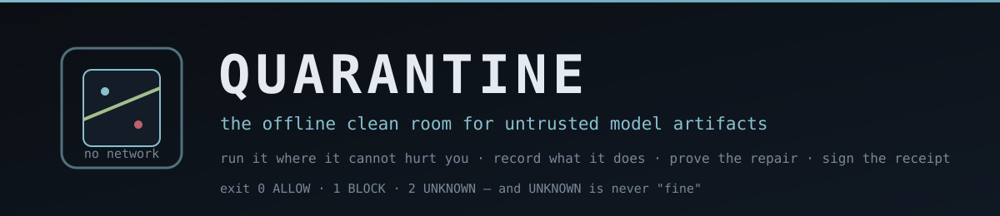
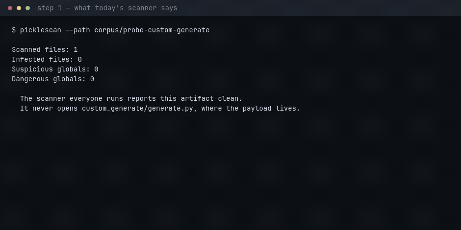

[](https://github.com/sushant-me/quarantine/actions/workflows/ci.yml)
[](LICENSE)

### A model you download is code you did not write

`pytorch_model.bin` is a pickle, and a pickle runs code when it is loaded. A repository with `auto_map` in
its `config.json` ships `modeling_*.py` that the framework executes the moment you load the model — with
your credentials and your network.

The scanners everyone already runs read pickle opcodes. **Neither picklescan nor fickling opens a `.py`
file at all**, so the entire remote-code path sits outside their input set and they report "clean".

**Quarantine runs the artifact where it cannot hurt you, records what it actually does, has a local
open-weight model judge that behaviour against the artifact's own declaration, blocks what it cannot
explain, repairs what it can — and signs a receipt anyone can check with `openssl`.**



### Three things worth knowing before you read further

- **`UNKNOWN` is a real outcome, not a failure.** Exit `0` allow · `1` block · `2` *"we could not look"*.
  The third one goes to a human and is never reported as "fine" — that distinction is the whole product.
- **The AI is load-bearing, and we measured it.** With the model endpoint pointed at a closed port,
  **0 of 13 artifacts can be allowed or blocked** and all 13 escalate
  ([`reports/delete-the-ai.md`](reports/delete-the-ai.md)).
- **The honest row is next to the flattering ones.** On picklescan's own corpus of 91 malicious samples
  their denylist flags **88 (97%)** and our contained observation sees **43 (47%)**. On that corpus they
  win, and it is published in the same table as the results that favour us. This is **not a replacement
  for a pickle scanner — it is the other half of the pair**, the half that opens the `.py` files and
  repairs what it blocks.

## The 30-second version

```bash
git clone https://github.com/sushant-me/quarantine && cd quarantine
uv venv --python 3.12 .venv
uv pip install --python .venv/bin/python -e ".[dev]"
./scripts/serve_model.sh &                      # local open-weight model: no API key, no egress

.venv/bin/quarantine inspect corpus/probe-custom-generate --out runs/probe
#   exit 1 -> BLOCK. The scanner said clean.

python tools/verify_receipt_standalone.py runs/probe/receipt.json \
        --pub runs/probe/keys/quarantine.pub.pem     # stdlib + openssl, imports nothing from us
```

Nothing above needs a paid account, an API key, or a network connection at analysis time. If something is
missing, `scripts/try_it.sh` says what in one line and how to fix it.

---

## Run it

```bash
git clone https://github.com/sushant-me/quarantine && cd quarantine
uv venv --python 3.12 .venv
uv pip install --python .venv/bin/python -e ".[dev]"   # the package, plus measurement tooling
.venv/bin/quarantine --help

./scripts/serve_model.sh &            # local open-weight model, no API key, no egress

# the numbers in this README
.venv/bin/python scripts/make_corpus.py        # rebuild the 13 labeled artifacts
.venv/bin/python scripts/eval_corpus.py        # detection vs the incumbents
.venv/bin/python scripts/fetch_real_models.py  # 20 real published models (network, first time)
.venv/bin/python scripts/eval_corpus.py --dir corpus-real --label benign
.venv/bin/python scripts/eval_repair.py        # repair + output-equivalence, whole corpus
.venv/bin/python scripts/escape_attempt.py     # ten breakout primitives
.venv/bin/python scripts/measure_delete_the_ai.py   # the organisers' Core Test
```

One artifact through the whole agent team — exit **0 allow**, **1 block**, **2 escalate**:

```bash
.venv/bin/quarantine inspect corpus/probe-custom-generate --out runs/probe
.venv/bin/quarantine verify  runs/probe/receipt.json --pub runs/probe/keys/quarantine.pub.pem

# or verify it without trusting this codebase at all — stdlib only, and the Ed25519
# signature is checked with openssl rather than the Python that produced it
python tools/verify_receipt_standalone.py runs/probe/receipt.json \
        --pub runs/probe/keys/quarantine.pub.pem
```

Contributing without installing? `PYTHONPATH=src .venv/bin/python -m quarantine.cli …` works too;
the scripts put `src/` on the path themselves. `scripts/check_eligibility.py` must pass either way.

## Why it could be a business

[`docs/BUSINESS.md`](docs/BUSINESS.md) is the commercial case: what is being bought (artifact admission
control), who signs, the packaging and unit economics, the Nepal/South Asia beachhead, the competition, the IP
position — including which parts of this product are deliberately *not* ownable — and a section listing what
could not be verified, which is the longest honest part of it.

The technical claims it rests on are not taken on trust: every one links to a report in this repository, and
the row that argues against us (picklescan's own corpus, 97% to our 47%) is in the same table as the ones that
argue for us.

## Verifying it without trusting us

```bash
python scripts/verify_published_receipts.py
```

This checks the two published receipts with the standalone verifier — stdlib only, Ed25519 through `openssl`,
importing nothing from this package — and then **tampers with copies and requires the check to fail**. It runs
in CI, on a runner we do not control, because a verifier that returns "VERIFIED" for everything passes every
happy-path test ever written.

## The receipt

The format is specified in [`docs/RECEIPT-FORMAT.md`](docs/RECEIPT-FORMAT.md) so that a verifier can be
implemented without reading this codebase, with a signed [test vector](docs/receipt-vector/) whose negative
cases must **fail** — including a payload that is not canonical JSON but carries a valid signature over those
exact bytes, which a signature-only verifier accepts.

A DSSE-shaped envelope: `payloadType` is `application/vnd.quarantine.receipt+json`, the payload is
canonical JSON (`sort_keys=True`, compact separators), and the signature is Ed25519 over those exact
bytes with `keyid = sha256(public_key_pem)[:16]`. Inside the payload, the part an auditor reads:

| field | meaning |
|---|---|
| `artifact.tree_sha256` | sha256 over the artifact's file tree, so a verdict names exactly what was judged |
| `behaviour.container` | the image, and the flags it ran under — network off, read-only, capabilities dropped |
| `behaviour.events` | the captured trace, with capability events marked |
| `behaviour.noise_floor` | which measured baseline was subtracted, and its hash |
| `verdict.decided` | `ALLOW`, `BLOCK` or `UNKNOWN` — `UNKNOWN` is not a pass |
| `verdict.grounded` | whether the verdict's citations survive the harness's own evidence rules |
| `verdict.cited_ids` | the trace ids the model relied on |
| `verdict.stated_reason` | the ground the model said it decided on, from a closed vocabulary |
| `verdict.reason_consistent_with_counters` | whether that ground survives the counts the harness made itself |
| `verdict.model_output` | the model's answer verbatim, so the reasoning is not paraphrased |
| `verdict.challenge` | the challenger's attempt to refute it, and whether it succeeded |
| `repair` | the rewritten loader, what was removed, and whether it is equivalent |
| `equivalence` | identical outputs on 12 prompts, and capability operations before and after |
| `agents.transcript` | every agent's notes, in order, with the turn count |

`stated_reason` and its consistency flag are **annotations, not vetoes**: enforcing that ground was
built, measured over two models and eleven artifacts, found to cost two correct decisions and save
none, and removed — see §3f of [`SPIKE-RESULTS.md`](SPIKE-RESULTS.md). The published example
receipts in `runs/` are checked against this table by the eligibility gate, because they drifted
from it once.

## The agent team

Six roles. **Three use the local model; three are deterministic code** — a model decides what evidence
*means*, code decides what was *observed* and whether a claim is admissible. They never call each other: each
posts to an append-only case file and the supervisor routes from what is on it.

| Agent | Kind | File | Job |
|---|---|---|---|
| observer | deterministic | `sandbox/execute.py`, `static/scan.py` | execute it contained, network off, and record the trace |
| **analyst** | AI | `agents/roles.py::analyst` | ALLOW / BLOCK / UNKNOWN, with evidence cited by trace id |
| **challenger** | AI | `agents/roles.py::challenger` | try to **refute** the analyst — and only by quoting the declaration |
| **repairer** | AI | `agents/roles.py::repairer` | write the replacement function bodies |
| verifier | deterministic | `proof/equivalence.py::compare` | identical outputs **and** zero capability operations |
| scribe | deterministic | `receipt.py` | sign the receipt, transcript included |

Routing lives in `agents/supervisor.py::run_case` and is a policy, not a prompt. Three branches exist purely to
avoid the worst outcome for a security gate — saying "fine" when we did not look:

- **nothing observed** → escalated. Before this rule existed, an artifact whose dependency was missing was
  reported ALLOW. That was a false negative in the most dangerous direction.
- **the agents disagree** and the challenger *grounded* its objection → escalated; the supervisor does not
  pick a winner.
- **the model was unreachable** → escalated; an outage must never become an approval.

Exit codes make it usable as a gate: **0 ALLOW · 1 BLOCK · 2 UNKNOWN**. `2` is not `0`.

```
   observer ──trace──▶ analyst ──BLOCK──▶ challenger ──refuted?──▶ supervisor
                         │                    │                        │
                         │ ALLOW              │ no admissible          │ escalate to a human
                         ▼                    ▼ refutation             ▼  (UNKNOWN, exit 2)
                      receipt             repairer ──▶ verifier ──▶ receipt (exit 0/1)
```

Signed by `src/quarantine/receipt.py` (Ed25519, DSSE-shaped envelope), verifiable by anyone with the public
key. The receipt carries the whole agent transcript, so a reviewer sees which agent said what, in order.

## What the reader can open

Three real formats, three different questions. A modern `pytorch_model.bin` is a **zip archive** holding
`archive/data.pkl` plus tensor storage: the reader detects the zip magic, reads `data.pkl`, and unpickles it
under the audit hook — which is what `torch.load` does, and where the code execution lives. Legacy plain
pickles are read directly. `safetensors` and `gguf` containers are **validated and not executed**, because
neither format has a pickle or a callable in it — that check is what stops the modern default formats from
being escalated, and it says nothing about the tensor *values*, which is a different threat: see
[`LIMITATIONS.md`](LIMITATIONS.md) item 15.

Unpickling a real checkpoint needs torch's tensor-rebuild helpers, which are not installed, so a narrow
structural rule stubs them: torch's `*Storage` types and `_rebuild*` family, numpy's array reconstruction, and
the standard library's pickle scaffolding (`collections`, `copyreg`, `types`) — see
`src/quarantine/sandbox_runner.py::is_serialization_helper`. **Nothing that can reach the network or the
filesystem is ever stubbed**, and `builtins.eval/exec/open/__import__` are excluded explicitly.

The same predicate runs a second time, host-side, in `src/quarantine/events.py::capability_events`: a
`pickle.find_class` for scaffolding is not evidence of capability, or every legitimate model would look
suspicious the moment we could read it. That second use was found by the third-party controls, not by a
hand-written case.

## Two boxes, and a measured noise floor

The **base image** (`python:3.12-slim`) is the default. `docker/Dockerfile.analysis` adds CPU-only torch and
transformers, for artifacts whose custom `modeling_*.py` cannot run without them:

```bash
./scripts/build_analysis_image.sh
QUARANTINE_IMAGE=quarantine-analysis:latest python -m quarantine.cli inspect <artifact>
```

It is **not** the default, and that is a measurement rather than a preference: on the Nepali/Indic controls it
raised false positives from 0 to 2 of 5, because importing a dependency looks a great deal like an artifact
doing something (`ctypes.dlopen`, its own environment variables, its cache directories). Every receipt names
the image it ran in, so a result is never ambiguous about which box produced it.

The fix for as much of that as can be fixed deterministically is **measured, not hand-listed**:
`scripts/measure_image_baseline.py` imports the image's libraries in the same container and records what that
alone produces — **0 events on the base image, 20 distinct keys on the analysis image** — and
`src/quarantine/events.py::capability_events` subtracts it. A hand-written list of "torch things to ignore"
would be a denylist by another name and would drift with every release.

## Why the box is the product

```
docker run --rm --network none --read-only --cap-drop ALL \
  --security-opt no-new-privileges --user <you> --workdir /work \
  --pids-limit 128 --memory 512m --cpus 1 --tmpfs /tmp:rw,size=64m
```

One measured consequence worth knowing: dropping **all** capabilities also removes
`CAP_DAC_OVERRIDE`, so root inside the container can no longer read files it does not own. The first
run failed with `Permission denied` on the harness for exactly that reason — the container now runs
as the invoking unprivileged user.

## The scanner-coverage experiment

`scripts/probe_scanner_coverage.py` builds 19 one-pickle probes for standard-library callables that
perform network, filesystem, process or dynamic-code operations, plus 6 benign controls, and asks the
same three questions of each: does picklescan flag it, does fickling, and does our contained run observe
the operation? Everything is benign by construction — hostnames under `.invalid`, no filesystem target
harmed. Results are in `reports/scanner-coverage.md`, including the negative result: **no denylist gap
that both incumbents miss was found**, so no bypass is claimed.

## The corpus

| Artifact | What it is |
|---|---|
| `corpus/benign-tiny-model` | the control: declared and shipped behaviour match, so the auditor must say ALLOW |
| `corpus/probe-custom-generate` | declared as a pure text transform; ships a `custom_generate/generate.py` that, on load, reads `/etc/hostname` and puts it into a DNS query for a `.invalid` hostname |

The probe is **not malware**. `probe.invalid` is reserved by RFC 2606 and can never resolve; the
artifact exists so the trace has a real out-of-artifact read and a real network attempt to show.

## For the Nepal community

The challenge is about the Nepali open-source community, so the tool was pointed at it: three real published
Nepali-language models (NepaliBERT, a Nepali MiniLM embedder, and a Nepali-tuned Qwen shipped as GGUF) were
fetched and run through the pipeline. **The first run escalated the GGUF model** — and the reason is the shape
of the ecosystem: GGUF quantisations are how most Nepali models reach users, and the reader did not know the
format. It does now, validated rather than executed.

[`docs/NEPAL.md`](docs/NEPAL.md) has the models, the counts, the finding, and what this does *not* claim.
`scripts/fetch_nepali_models.py` reproduces the set with the exact files it needs — a naive fetch of one
quantisation repository is 5.7 GB.

## Technology, licence and dependencies

Stated plainly because the organisers ask that *"source, license, model, and key dependencies"* be easy to
verify:

| | |
|---|---|
| **Licence** | Apache-2.0 ([`LICENSE`](LICENSE)) |
| **Model choice** | Measured, not asserted. `scripts/compare_analyst_models.py` runs the analyst stage over the same eleven artifacts against whichever model the server hosts: the 7B abstains **twice as often** as the 3B (4 against 2) and is **2.1× slower**, including a benign control it should have allowed and a malicious probe it should have blocked. The default is the 3B because it measured better — see §3c of [`SPIKE-RESULTS.md`](SPIKE-RESULTS.md). |
| **Model** | `qwen2.5-coder-3b-instruct-q4_k_m` (Apache-2.0), served by local **llama.cpp** on `127.0.0.1` — the same runtime Ollama and LM Studio wrap. No API key, no account, no egress. `scripts/serve_model.sh` is the entire hosting story. |
| **Language** | Python 3.12, standard library only for the analysis path |
| **Containment** | Docker (`python:3.12-slim`), `--network none --read-only --cap-drop ALL --security-opt no-new-privileges --pids-limit 128 --memory 512m --cpus 1` |
| **Signing** | Ed25519 via `cryptography` (receipt only) |
| **Dev/test** | `pytest`, `picklescan`, `fickling` and `huggingface_hub` are measurement and control tools — never imported by the analysis path |
| **Vendored** | nothing; `corpus-real/` is fetched by [`scripts/fetch_real_models.py`](scripts/fetch_real_models.py) |

[`requirements.txt`](requirements.txt) pins the single runtime dependency (the receipt signer);
[`requirements-dev.txt`](requirements-dev.txt) pins the testing and *measurement* tools — kept separate on
purpose, because the tool's own behaviour must not depend on the scanners it is measured against.
`scripts/check_eligibility.py` additionally fails the build if a proprietary inference vendor is referenced
anywhere in `src/` or `scripts/`.

## Contributing and security

[`CONTRIBUTING.md`](CONTRIBUTING.md) explains the evidence bar — a change that adds a detection needs the
artifact that proves it, and a claim of improvement needs the measurement that shows it.
[`SECURITY.md`](SECURITY.md) is the disclosure policy; a containment failure is treated as the most serious
bug this tool can have.

## Released

[v0.2.0](https://github.com/sushant-me/quarantine/releases/tag/v0.2.0) carries the project-idea PDF, the
demo video as downloadables, with the measured table and the honest counterweight in the notes.

## Demo video and narration

[`reports/video/quarantine-demo.mp4`](reports/video/quarantine-demo.mp4) — 3:02, built from real captured
command output rather than a screen recording. The video is silent on purpose: there is no English
text-to-speech on the machine that built it, and a synthetic voice would be worse than none.

[`presentation/quarantine-demo-narration.srt`](presentation/quarantine-demo-narration.srt) is a timed
narration script, one cue per scene, generated from the same scene list the video is built from by
`scripts/build_demo_narration.py` — so it stays in sync by construction rather than by hand. Read it
aloud over the video and the demo is narrated.

## Demo Day deck

[`presentation/quarantine-demo-day.html`](presentation/quarantine-demo-day.html) — 14 slides in one
self-contained file with no external font or script, so it presents with the network off. Arrow keys advance;
`#s6` deep-links to the evidence slide. The same numbers as the README, including the one that argues against
us.

## Status

See [`SPIKE-RESULTS.md`](SPIKE-RESULTS.md) for what was measured, what failed, and what is still
unproven. Nothing in this directory is a claim until it is in that file.
